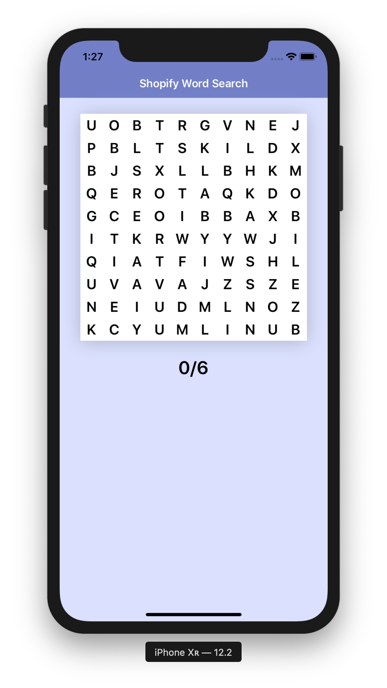
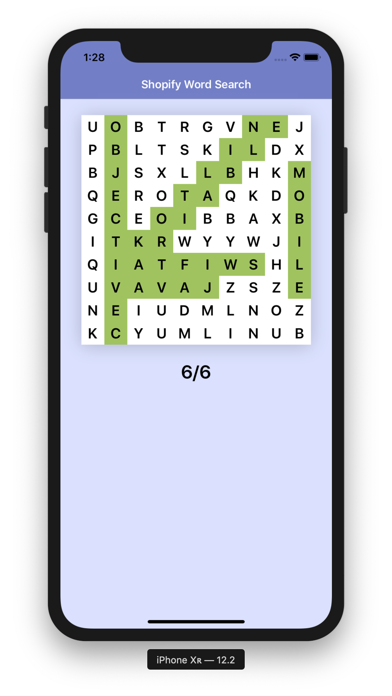

# Shopify Mobile Developer Intern Challenge F19

Doc: https://docs.google.com/document/d/17dFY9G46XMGz1VpLOxHcBZySqXVQ40xMjXcd8cJXeks/edit

This is my submission for Shopify's mobile developer internship challenge for the Fall 2019 term.

   
   

## The Application
This is an iOS application which randomly inserts a set of words into a matrix, afterwards, populating the available entries with random characters; a word serach puzzle. 

## Additional Features
1. Random Word Insertion
2. Swiping Gestures (Pan)

## Limitations
I came across various difficutlies when implementing my solution. There were definitely instances where I had to go back and improve my model or consider unexpected cases. 

### 1. Word Direction Computation
Due to the way I computed random insertions, there is a possibility that a set exists which cannot be inserted in the word search puzzle. I passed on this due to the likilihood of this happening being near nil given the constraints.

### 2. Line Overlay
I wanted to draw a bezier curve or explore other possible solutions instead of my current solution to highlighting a user's currently selected items. Within the implementation, I generated valid lines represented as a set of coordinates. This could have been used to draw a curve.

### 3. Results View
I would've liked to implemented a table which displayed the available solutions with some slick UI animations to enhance the experience. Unfortunately, I did not get the flow layout object to correctly configure and removed it from my final submission. This is the reason for the big white (purple) space at the bottom of the application. 

